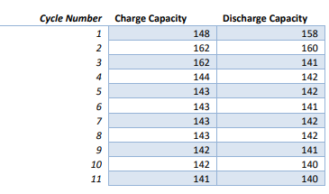
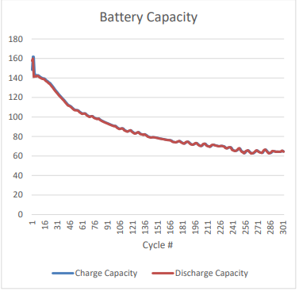

The problem was the following:

FBattery Parsing
For this problem, we’re going to have you parse data from a battery cycler. The goal is to see how charge capacity and discharge capacity change over 302 cycles of the battery.
For each half cycle (either a charge or discharge), you should pull out the maximum capacity. Here are approximate values for the first cycles. You don’t need to get these exactly.
(Check image with table, with "Cycle Number" "Charge Capacity" and "Discharge Capacity".)

The data file is battery_parsing_question.txt. It is a text file with some number of header rows followed by a data table. The data table is tab separated.

The columns that you should look at are Half Cycle, Cycle Number, Capacity/ma.h. The idea is that each number we want you to extract is capacity of a given half cycle which is usually the last value of capacity before the next half cycle.

The goal at the end is to be able to produce a graph like the one to the right that shows the battery capacity over all of the cycles. (Check image with table, with graph)

